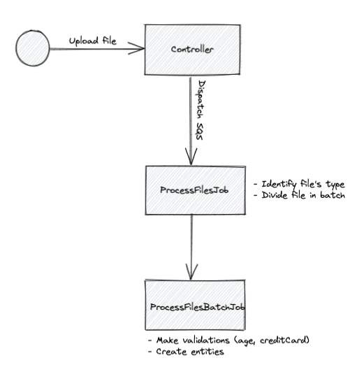

## File Processer

### Available endpoints

- `POST files/`
-> Allows an upload of a file and will put this file in a SQS queue.

### How it is structured

We have the following flow for a file(s):

